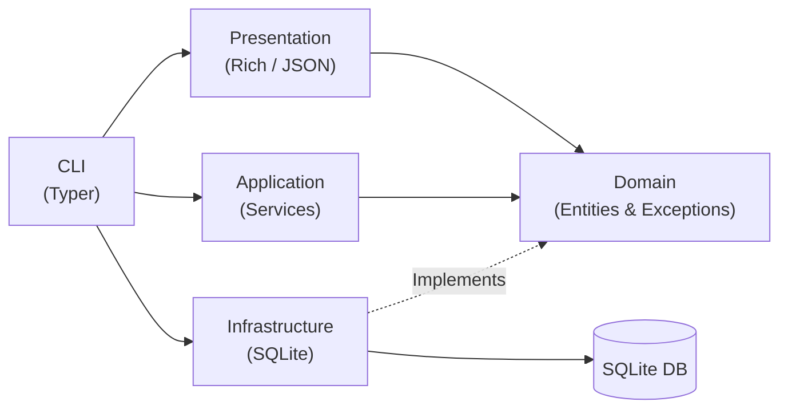

# Jotter

Jotter is a minimalist, terminal-based sticky note application built for developers.

## Features

- Create notes
- List notes
- View notes
- Edit notes
- Mark notes as done/open
- Search notes
- Remove notes
- Purge notes
- JSON output
- SQLite persistence

## Installation

You can install Jotter directly from GitHub using pip:

```bash
pip install git+https://github.com/sohansai/jotter.git
```

Alternatively, you can clone the repository and install it locally:

```bash
git clone https://github.com/sohansai/jotter.git
cd jotter
pip install .
```

## Usage

Use the `jotter` CLI to manage your notes. 

```bash
# Core commands
jotter --help
jotter --version

# Managing notes
jotter add "Update the database schema"
jotter list
jotter show 1
jotter edit 1 --body "Update the database schema and tests"

# Status and lifecycle
jotter done 1
jotter open 1
jotter remove 1
jotter purge

# Search
jotter search "schema"
```

To integrate with other tools, you can output the lists and searches as JSON:

```bash
jotter list --json
jotter search "schema" --json
```

## Data Storage

- SQLite is used for persistence.
- By default, the database is stored in your OS-specific user data directory (e.g., `~/.local/share/jotter/jotter.db`).
- You can override the database location by setting the `JOTTER_DB` environment variable to a specific file path.

## Architecture

Jotter follows a clean, modular architecture, adhering to Dependency Inversion principles.



- **CLI**: Powered by Typer. Responsible for parsing arguments and wiring up dependencies.
- **Presentation**: Responsible for formatting outputs via Rich (tables) or JSON.
- **Application**: Coordinates business logic and interacts with repositories via domain interfaces.
- **Domain**: Contains core entity classes (`Note`) and protocol interfaces (`NoteRepository`). It has zero dependencies on other layers.
- **Infrastructure**: Concrete implementations (SQLite) of the domain interfaces.

## Project Structure

```text
jotter/
├── .github/
├── docs/
├── src/
│   └── jotter/
│       ├── application/
│       ├── cli/
│       ├── configuration/
│       ├── domain/
│       ├── infrastructure/
│       └── presentation/
├── tests/
├── .gitignore
├── LICENSE
├── README.md
└── pyproject.toml
```

## Development

Set up your local environment for development:

```bash
python -m venv .venv

# On Linux/macOS:
source .venv/bin/activate
# On Windows:
# .venv\Scripts\activate

pip install -e ".[dev]"
```

Run the quality and static analysis checks:

```bash
pytest
ruff check src tests
ruff format --check src tests
mypy src tests
```

## Testing

The test suite covers:
- Core domain logic and application services.
- E2E execution of Typer CLI commands in an isolated `CliRunner`.
- SQLite persistence, edge cases, data isolation, and concurrent connections.
- Configuration and database resolution precedence.

Run `pytest` to execute all suites.

## Packaging

To build the project for distribution:

```bash
python -m pip install build
python -m build
```

The resulting `.whl` and `.sdist` artifacts will be output to the `dist/` directory.

## License

This project is licensed under the MIT License. See the [LICENSE](LICENSE) file for details.
